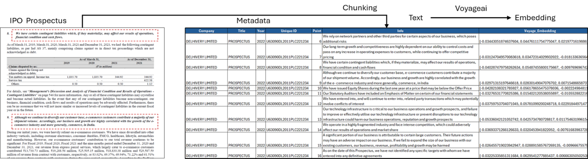
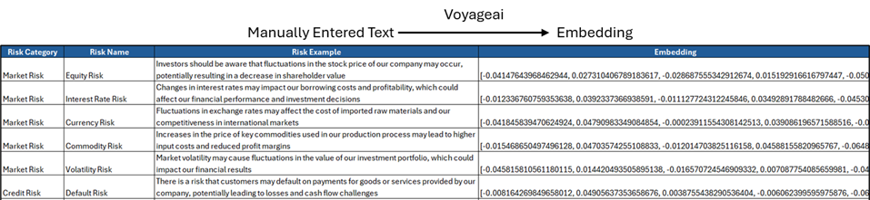
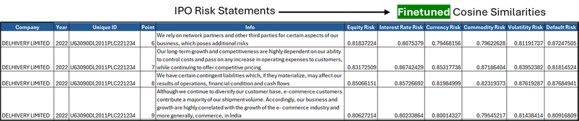
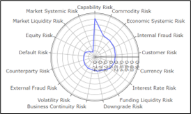
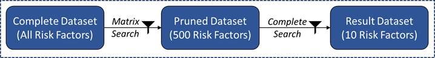
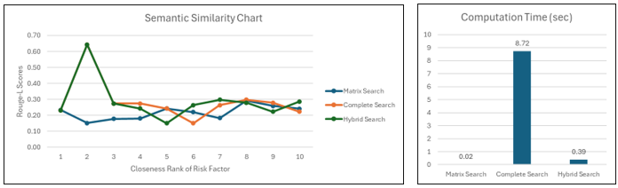
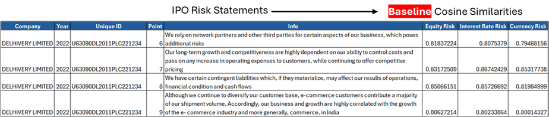
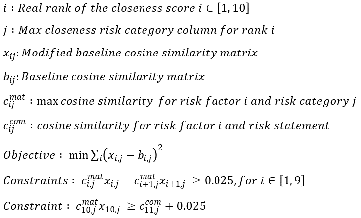

# LLM_Doc_Retrieval
Voyage-AI LLM embedded document search
*Reach out to me with any suggestions/questions on LinkedIN (https://www.linkedin.com/in/vishalkannan/)

## INTRODUCTION

Organizations across industries collect and author a lot of data in the form of documents. The information in these documents is not leveraged effectively as the employees authoring them often leave the company. Simulating this scenario, an LLM powered retriever is built for risk factors mentioned in public IPO filings (India).

## USE-CASE
An end user (employee of a company) describes a specific risk faced by his/her company. Out of the risk factors listed in public IPO filings from the past, find the 10 semantically closest risk factors to the one described.

## SOLUTION DESIGN
The Voyage AI embedder is used to embed the risk factors and the cosine similarity distance metric is used to identify the closest risk factors to a given risk statement input. The solution should be trainable and fine-tuneable by end users and the result will be assessed both for it’s accuracy and computation time.

## OBJECTIVES
•	Develop a complete retrieval functionality using cosine similarities against each Risk Factor
•	Develop a quick retrieval functionality with the ability to finetune the output 
•	Compare the quick and complete retrieval processes on accuracy/ time for an input text prompt

## DATA PREP
•	Vectorizing and storage of the risk factors found in the IPO documents in a vector database (csv)
•	Detailed description, vectorizing and storage of commonly understood risk categories
•	Finetuned distance matrix construction between the risk factors and risk categories  

**Risk Factors**

**Risk Categories**

**Finetuned Risk Matrix**

##RETRIEVAL ALGORITHMS

**Complete Search Algorithm**
1.	User inputs the risk description 
2.	Vectorize the risk description using the voyage-ai embedder
3.	Calculate the cosine similarity between the risk embedding and each embedding in the risk factors database (~8,000 Risk Factors)
4.	Select the 10 closest risk factors and record the time taken for the complete search function

**Matrix Search Algorithm**
1.	User inputs the risk description 
2.	Vectorize the risk description using the voyage-ai embedder
3.	Calculate the cosine similarity between the risk embedding and each embedding in the risk categories database (17 Risk Categories)

4.	Multiply the Finetuned risk matrix with the cosine similarity values from the previous step (multiply same column names together)
5.	Select the max similarity for each risk statement among the Risk Columns as the closeness score
6.	Select the 10 closest risk factors and record the time taken for the matrix search function

**Hybrid Search Algorithm**

Combining the best of both worlds

**PERFORMANCE METRICS**

**Semantic Accuracy**

1.	Rouge-L score (longest common subsequence) is used to assess the semantic similarity between the 10 selected risk factors and the input risk statement
2.	Rouge-L metric calculation between the input risk statement and the risk factors from each search type
3.	Plot the Rouge-L metric on a graph for display

**Compute Time**

1.	Record the time taken to execute both forms of search (matrix, complete and hybrid search)
2.	Plot the time taken on a graph

**CONCLUSION**

An organization can reliably manage their documents and leverage their knowledge base by building an LLM powered retrieval engine. The model will need periodic updates to the text data stored in the vector database and semi-regular fine tuning depending on the feedback from the end users.

**FINE-TUNING HEURISTIC**

1.	The baseline cosine similarity matrix is generated by calculating the cosine similarities between the Risk Factors embeddings and Risk Categories embeddings

2.	For each risk statement in the training dataset:
•	Generate the vector embeddings using voyage ai
•	Calculate the cosine similarity with each risk factor embedding
•	Calculate the cosine similarity with each risk category embedding
3.	Using the complete search functionality rank the factors by distance. These are the real ranks.
4.	Using the matrix search functionality rank the factors by distance. These are the calculated ranks.
•	Multiply the baseline cosine similarity matrix with the cosine similarity scores between the risk statement and risk category embeddings
•	Identify the column with the maximum closeness score from the product for each risk factor and select the closeness score
•	Select the maximum closeness score for each risk factor and determine the calculated ranks for each risk factor
5.	Develop a mathematical model (cvxpy library) to modify the baseline cosine similarity matrix to equalize the real ranks and calculated ranks for the first 10 ranks

6.	Replace the old baseline cosine similarity matrix values with the variables from the mathematical model
7.	Move on to the next risk statement in the training dataset
8.	For this project, each IPO risk statement was used to fine-tune the baseline cosine similarity matrix

**The Filenames column lists out the files to look into in the IPO Docs folder**
