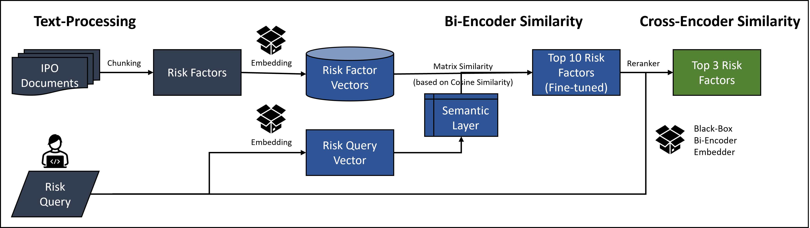

# Advanced RAG of IPO Risk Factors

Voyage-AI LLM embedded document search and BGE reranker

*Reach out to me with any suggestions/questions on LinkedIN* (https://www.linkedin.com/in/vishalkannan/)

Pre-Requisites

The requirements.txt lists all the Python libraries used

pip install -r requirements.txt

## INTRODUCTION

Organizations across industries collect and author a lot of data in the form of documents. The information in these documents is not leveraged effectively as the employees authoring them often leave the company. Simulating this scenario, an LLM powered retriever is built for risk factors mentioned in public IPO filings (India).

## USE-CASE
An end user (employee of a company) describes a specific risk faced by his/her company. Out of the risk factors listed in public IPO filings from the past, find the 10 semantically closest risk factors to the one described.

## SOLUTION DESIGN

## BI-ENCODER SIMILARITY

The Voyage AI embedder is used to embed the risk factors and the cosine similarity distance metric is used to identify the closest risk factors to a given risk statement input. The solution should be trainable and fine-tuneable by end users and the result will be assessed both for it’s accuracy and computation time.

**OBJECTIVES**

-	Develop a complete retrieval functionality using cosine similarities against each Risk Factor
-	Develop a quick retrieval functionality with the ability to finetune the output 
-	Compare the quick and complete retrieval processes on accuracy/ time for an input text prompt

**DATA PREP**

-	Vectorizing and storage of the risk factors found in the IPO documents in a vector database (csv)
-	Detailed description, vectorizing and storage of commonly understood risk categories
-	Finetuned distance matrix construction between the risk factors and risk categories  

**Risk Factors**

**Risk Categories**

**Finetuned Risk Matrix**

**Search ALGORITHMS**

**Complete Search Algorithm**

1.	User inputs the risk description 
2.	Vectorize the risk description using the voyage-ai embedder
3.	Calculate the cosine similarity between the risk embedding and each embedding in the risk factors database (~8,000 Risk Factors)
4.	Select the 10 closest risk factors and record the time taken for the complete search function

**Matrix Search Algorithm**

1.	User inputs the risk description 
2.	Vectorize the risk description using the voyage-ai embedder
3.	Calculate the cosine similarity between the risk embedding and each embedding in the risk categories database (17 Risk Categories)

4.	Multiply the Finetuned risk matrix with the cosine similarity values from the previous step (multiply same column names together)
5.	Select the max similarity for each risk statement among the Risk Columns as the closeness score
6.	Select the 10 closest risk factors and record the time taken for the matrix search function

**Hybrid Search Algorithm**

Combining the best of both worlds

**PERFORMANCE METRICS**

**Semantic Accuracy**

1.	Rouge-L score (longest common subsequence) is used to assess the semantic similarity between the 10 selected risk factors and the input risk statement
2.	Rouge-L metric calculation between the input risk statement and the risk factors from each search type
3.	Plot the Rouge-L metric on a graph for display

**Compute Time**

1.	Record the time taken to execute both forms of search (matrix, complete and hybrid search)
2.	Plot the time taken on a graph

## CROSS-ENCODER SIMILARITY

**The semantically closest risk factors (and their metadata) is available for review**

## FINE-TUNING HEURISTIC (Matrix-Search Input)

1.	**Initialize Baseline Cosine Similarity Matrix**

	Calculate the cosine similarities between the embeddings of Risk Factors and Risk Categories to form the baseline cosine similarity matrix.

2.	**Determine Real Ranks**

	Use the complete search functionality to rank the Risk Factors based on their distances to Risk Categories. These ranks represent the ground truth or real ranks.

3.	**Determine Initial Calculated Ranks**

	Use the matrix search functionality to rank the Risk Factors by distance using the initial baseline cosine similarity matrix. These are the initial calculated ranks.

4.	**Compute Closeness Scores**

	Multiply the baseline cosine similarity matrix with the cosine similarity scores between the risk statement embeddings and risk category embeddings.

5.	**Identify Maximum Closeness Scores**

	For each Risk Factor, identify the column (Risk Category) with the maximum closeness score and select this score.

6.	**Determine Calculated Ranks**

	Select the maximum closeness score for each Risk Factor to determine the calculated ranks.

7.	**Optimization Model**

-	Use gradient descent or a similar optimization technique to solve the optimization problem.
-	A mathematical optimization model is developed using the cvxpy library to adjust the baseline cosine similarity matrix.
-	The goal is to minimize the difference between the real ranks and calculated ranks for the top 10 ranks.
-	The variables in the optimization model represent the adjusted similarity scores.

8.	**Update Baseline Cosine Similarity Matrix**

	Replace the old baseline cosine similarity matrix values with the optimized variables obtained from the mathematical model.

9.	**Fine-Tuning over the Dataset**
	
	Move to the next risk statement in the training dataset and repeat the process (steps 4-9) for each risk statement to iteratively fine-tune the baseline cosine similarity matrix.
